# Valorant Pro Play EDA — Analysis Results

This report presents findings from the exploratory data analysis comparing **Tier 1 (VCT)**, **Tier 2 (VCL)**, **Game Changers (GC)**, **Tier 3**, and **Collegiate** matches, spanning **60,594 completed maps** across **28,921 final matches**.

---

## 1. Dataset Baseline & Volume

* **Total Completed Maps**: 60,594 (Tier 1: 17,462 | Tier 2: 18,813 | Game Changers: 7,657 | Tier 3: 16,343 | Collegiate: 319)
* **CT Round Win Rate**: Tier 1 is exactly balanced at **50.00%** CT-win. Tier 2 is slightly T-sided at **49.27%** CT-win, Game Changers is T-sided at **48.62%** CT-win, Collegiate is balanced at **49.84%** CT-win, while Tier 3 is slightly CT-sided at **50.83%** CT-win.
* **Match Format**: Bo3 is dominant across all tiers, with Bo5 reserved for Grand Finals and late-stage brackets.
* **Map Selection Proportions (Temporal Skew)**: Tier 2, Game Changers, Tier 3, and Collegiate feature a significantly higher proportion of newer maps in their history compared to Tier 1:
  - **Lotus**: T2: **13.20%** | GC: **12.33%** | T3: **11.54%** | Collegiate: **8.15%** vs. T1: **5.14%**
  - **Pearl**: T2: **7.65%** | GC: **9.82%** | T3: **8.62%** | Collegiate: **6.90%** vs. T1: **2.34%**
  - **Sunset**: T2: **5.74%** | GC: **7.39%** | T3: **6.92%** | Collegiate: **5.96%** vs. T1: **2.26%**
  This is driven by a strong temporal skew: **71%** of Tier 1 matches in the dataset were played in the early era (2021–2022, Episodes 2–4) before these newer maps were introduced, whereas over **90%** of Tier 2, GC, Tier 3, and Collegiate matches are from the modern era (2023–2026, Episodes 6–12) when these maps were active in rotation.

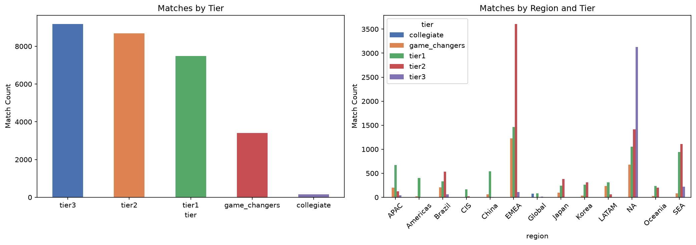
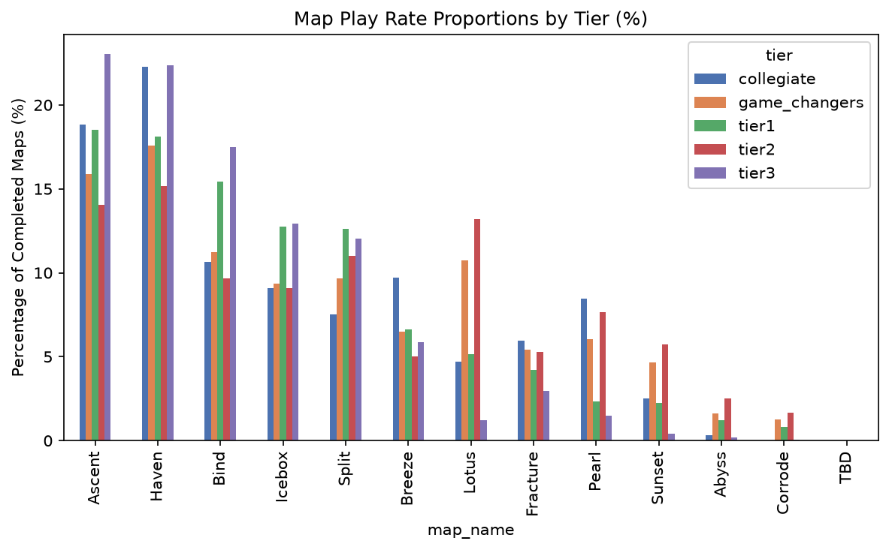
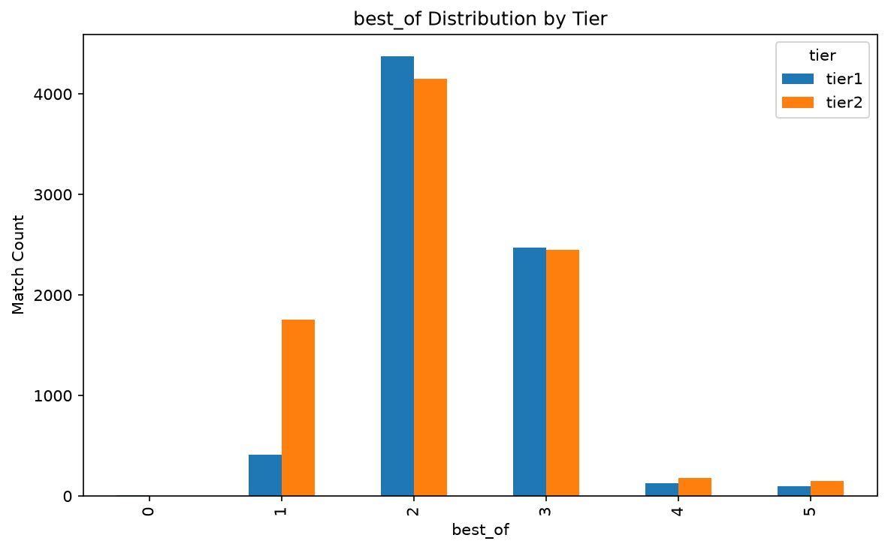
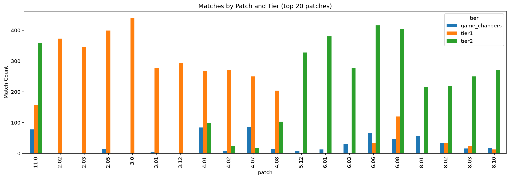

---

## 2. Map & Pick Dynamics

* **Median Score Margin (Round Differential)**: 5.0 rounds in T1, T2, T3, and Collegiate, but rises to **6.0 rounds** in Game Changers.
* **Average Score Margin**: **5.94** rounds in Game Changers, **5.67** rounds in Tier 1, **5.63** rounds in Tier 3, **5.45** rounds in Tier 2, and **5.43** rounds in Collegiate. This suggests that Game Changers matches have the highest blowout rate, while Collegiate and Tier 2 feature the closest, most competitive matches on average.
  - **13-0 Sweeps**: GC: **1.29%** | T1: **0.90%** | T3: **0.86%** | T2: **0.58%** | Collegiate: **0.00%**
  - **13-1 Sweeps**: GC: **3.30%** | T1: **2.63%** | T3: **2.40%** | T2: **1.79%** | Collegiate: **0.94%**
* **Overtime Rate**: Tier 2 maps go to overtime **8.05%** of the time, followed by Tier 3 at **7.74%**, Tier 1 at **7.66%**, Game Changers at **7.08%**, and Collegiate at **6.27%** (the lowest overtime rate).
* **Pick Advantage**: Teams win on their own map picks **51.99%** of the time in T1, **51.00%** in T2, **51.24%** in GC, **51.15%** in T3, and **51.12%** in Collegiate. Map selection choice offers only a marginal win-rate boost.

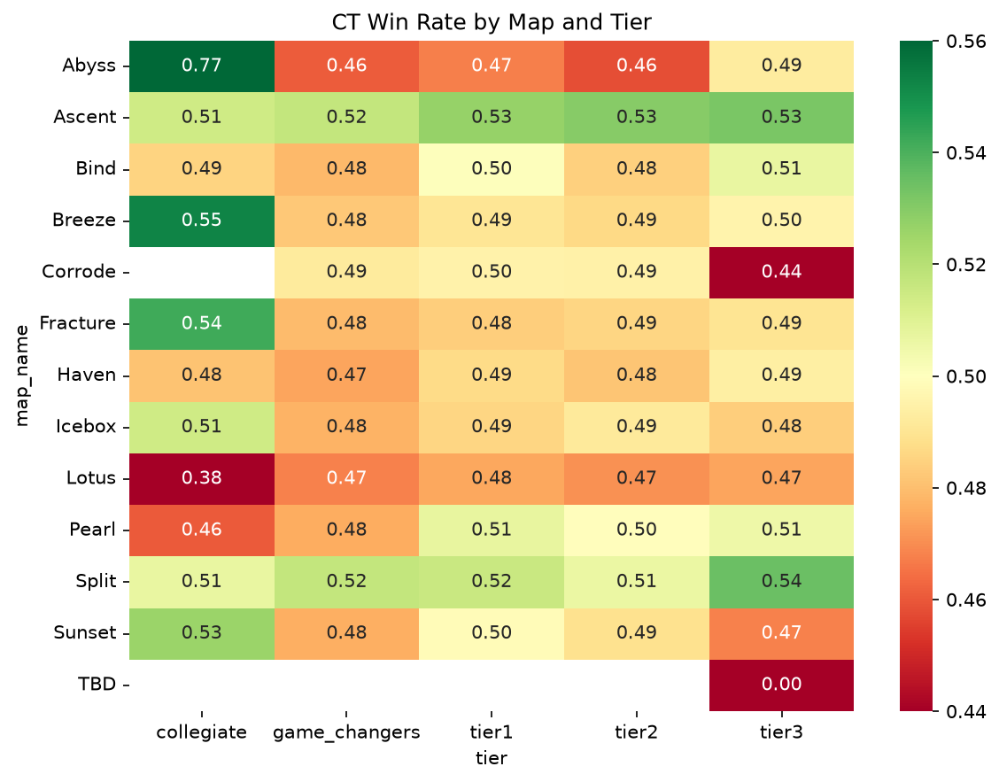
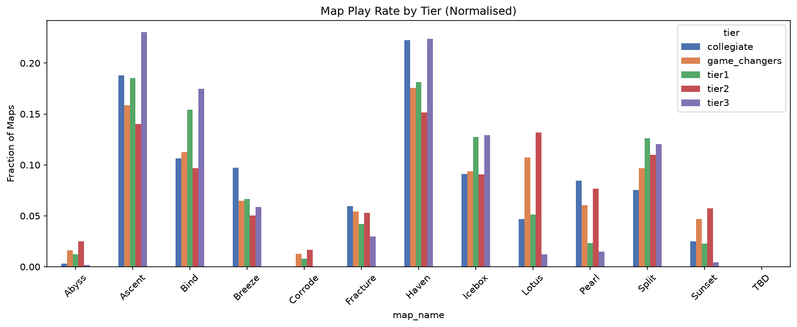
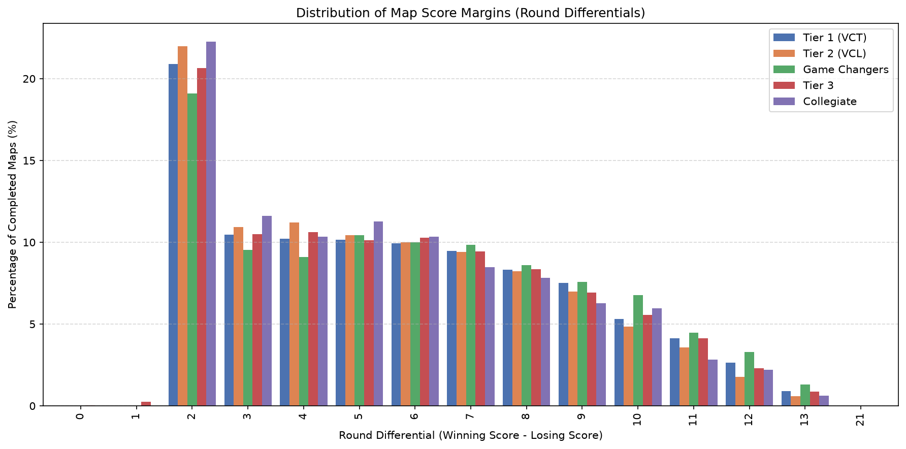
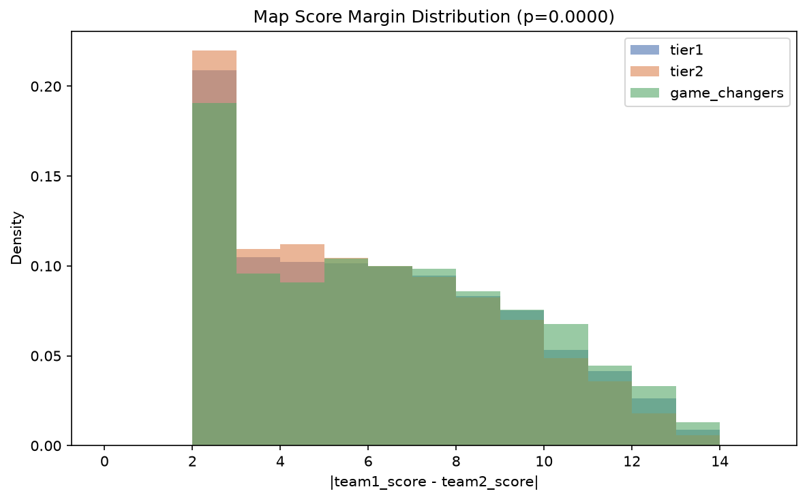
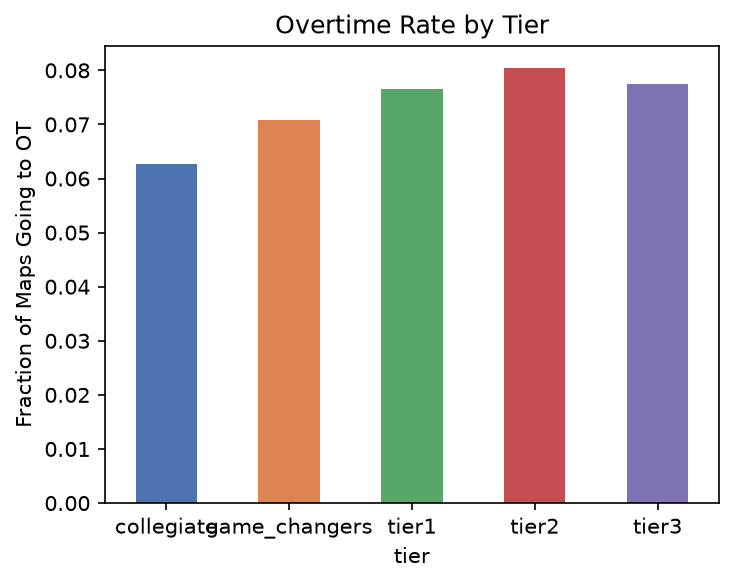

---

## 3. Player Performance & Agent Meta

### Team-Level Stat Correlations with Map Wins (Pearson $r$)
Individual and team-level metrics correlate with map wins at near-identical levels across all five tiers:

| Metric | Tier 1 (VCT) | Tier 2 (VCL) | Game Changers | Tier 3 | Collegiate |
| :--- | :--- | :---: | :---: | :---: | :---: |
| **Total KD Diff** | 0.833 | 0.831 | **0.840** | 0.833 | 0.836 |
| **Mean Rating** | 0.787 | 0.792 | **0.796** | 0.791 | 0.795 |
| **Mean ACS** | 0.721 | 0.714 | 0.734 | 0.713 | **0.740** |
| **Mean KAST** | 0.698 | 0.688 | **0.708** | 0.703 | 0.697 |
| **Mean ADR** | 0.667 | 0.679 | **0.710** | 0.660 | 0.706 |
| **Total FK Diff** | 0.519 | 0.508 | **0.551** | 0.516 | 0.504 |

> [!NOTE]
> Game Changers, Collegiate, and Tier 3 show slightly higher correlations between individual combat stats (ADR, ACS, KAST, first kills) and map win rate. This is consistent with a slightly more open playstyle where individual star players have a marginally higher direct impact on match outcomes.

### Clutches & Multifrags Comparison (per 100 Rounds)

| Event Type | Tier 1 (VCT) | Tier 2 (VCL) | Game Changers | Tier 3 | Collegiate |
| :--- | :--- | :---: | :---: | :---: | :---: |
| **Double Kill (2K)** | 12.42 | 12.37 | 12.52 | 12.64 | **12.79** |
| **Triple Kill (3K)** | 3.87 | 3.89 | 3.95 | 3.91 | **3.99** |
| **Quadra Kill (4K)** | 0.799 | **0.814** | **0.814** | 0.807 | 0.749 |
| **Ace (5K)** | 0.092 | 0.094 | 0.101 | 0.087 | **0.109** |
| **1v1 Clutch** | 0.949 | **0.987** | 0.985 | 0.984 | 0.947 |
| **1v2 Clutch** | 0.489 | 0.497 | 0.514 | 0.502 | **0.555** |
| **1v3 Clutch** | 0.129 | 0.139 | 0.140 | 0.133 | **0.149** |
| **1v4 Clutch** | 0.024 | 0.025 | **0.029** | 0.023 | 0.015 |
| **1v5 Clutch** | 0.003 | 0.003 | **0.004** | 0.002 | 0.000 |

> [!TIP]
> **Key Finding**: Clutches and multi-kills are won at the highest rate in Collegiate and Game Changers play. 
> This indicates that VCT (Tier 1) teams display tighter coordination, crossfires, and spacing in numbers-advantage situations, making solo clutch plays and multi-kills much harder to execute. Game Changers, VCL, and Collegiate exhibit slightly more open, individualistic play that enables lone players to find isolated duels and convert hero rounds.

### Player Performance across Roles & Tiers (Average Rating)

| Player Role | Tier 1 (VCT) | Tier 2 (VCL) | Game Changers | Tier 3 | Collegiate |
| :--- | :--- | :---: | :---: | :---: | :---: |
| **Sentinel** | 0.9822 | 0.9962 | 0.9989 | 0.9785 | **1.0178** |
| **Duelist** | 1.0319 | 1.0248 | 1.0349 | **1.0351** | 1.0157 |
| **Controller** | 0.9855 | **1.0036** | 0.9969 | 0.9849 | 0.9966 |
| **Initiator** | 0.9786 | 0.9820 | 0.9812 | **0.9857** | 0.9953 |

> [!TIP]
> **Key Finding**: Collegiate features a highly unique role-rating distribution where **Sentinels achieve the highest ratings of all roles** (even out-performing Duelists). 
> This is a strong contrast to the professional tiers where Duelists dominate ratings. It indicates that in collegiate leagues, defensive anchoring setups are highly efficient and yield large kill counts against uncoordinated entries. 
> Conversely, Duelists dominate ratings in Tier 3 where loose, aggressive playmaking is highly rewarded.

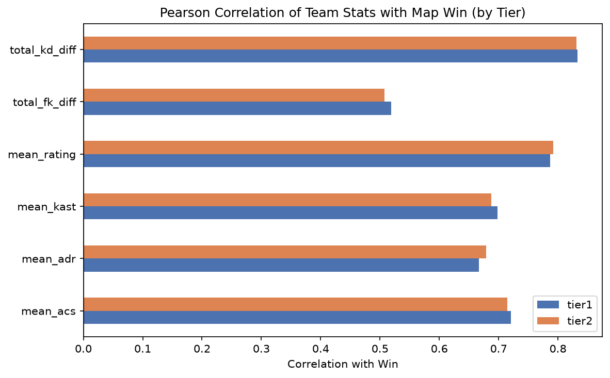
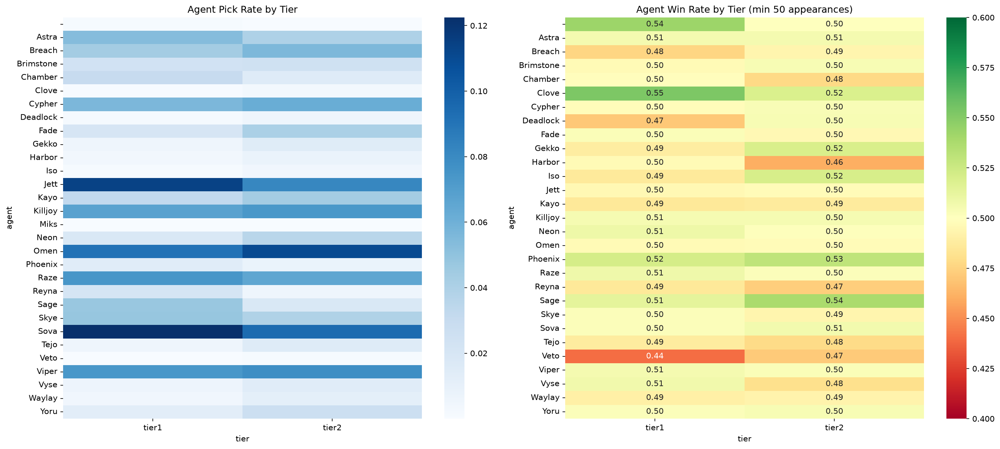
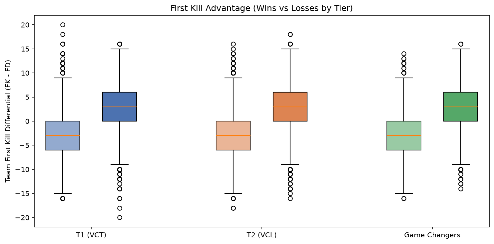
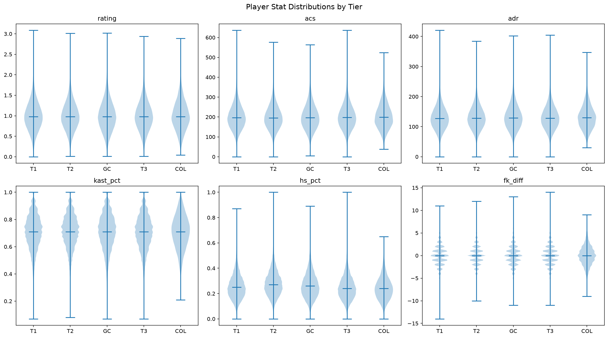
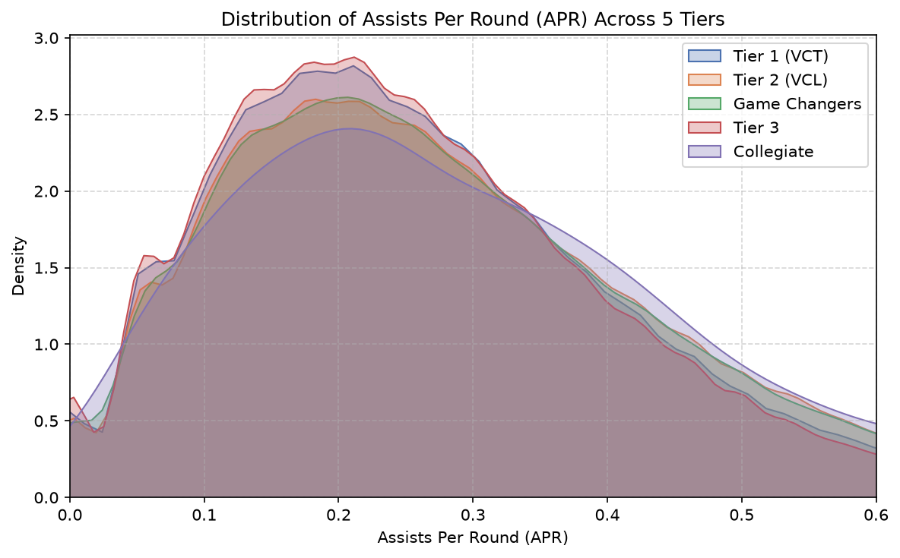
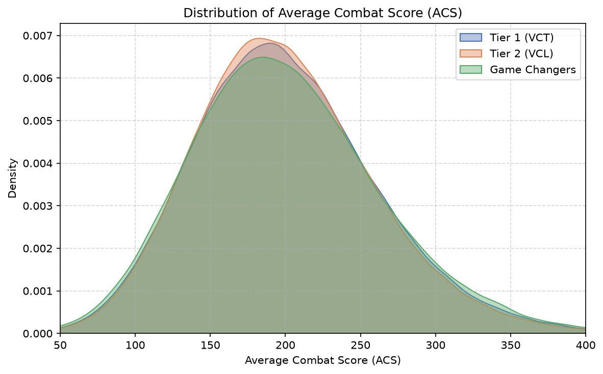
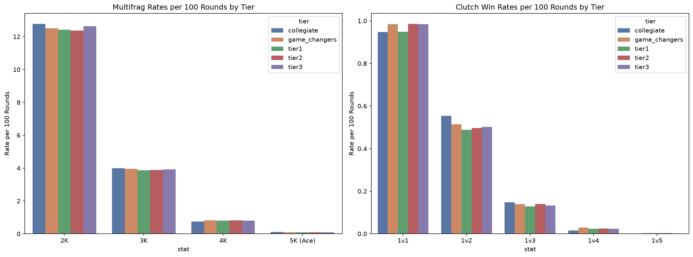
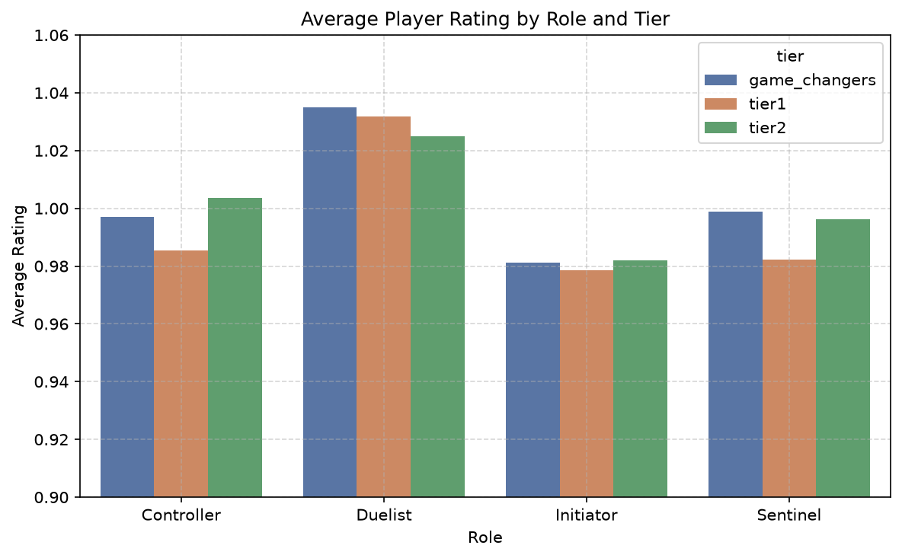

---

## 4. Economic & Halftime Dynamics

* **Pistol Round Leverage**: Winning both pistol rounds on a map boosts series winrate to a **staggering 82.69% in Collegiate**, compared to **69.49%** in GC, **67.22%** in T1, **65.13%** in T3, and **64.53%** in T2.
  - Conversely, winning 0 pistols in Collegiate yields only a **17.31%** series win rate!
  - This indicates that economic momentum and round-start snowballing are extremely severe in Collegiate tournaments compared to all other tiers.
* **Halftime Leader Win Rate**: Leading at halftime (rounds 1–12) is a massive predictor of map victory:
  - **Game Changers**: **79.48%** win rate
  - **Tier 1 (VCT)**: **78.86%** win rate
  - **Tier 3**: **78.57%** win rate
  - **Collegiate**: **78.06%** win rate
  - **Tier 2 (VCL)**: **77.66%** win rate

### Round Win Rates by Buy Type (%)

| Tier | Eco (Pistols Included) | Semi-Eco | Semi-Buy | Full Buy |
| :--- | :---: | :---: | :---: | :---: |
| **Tier 1 (VCT)** | 43.20% | 19.96% | **53.70%** | 53.92% |
| **Tier 2 (VCL)** | **43.78%** | **21.97%** | 52.70% | 53.90% |
| **Game Changers** | 43.37% | 20.76% | 52.60% | **54.33%** |
| **Tier 3** | 43.49% | 20.25% | 52.78% | 54.32% |
| **Collegiate** | 43.31% | 20.24% | 52.39% | 54.07% |

### Win Probability by Halftime Round Deficit

| Halftime Deficit | Tier 1 (VCT) | Tier 2 (VCL) | Game Changers | Tier 3 | Collegiate | Deficit Score Examples |
| :--- | :---: | :---: | :---: | :---: | :---: | :---: |
| **0 rounds (Tie)** | 50.00% | 50.00% | 50.00% | 50.00% | 50.00% | 6 - 6 |
| **2 rounds** | 32.38% | 32.29% | 30.37% | 32.86% | **34.04%** | 7 - 5 |
| **4 rounds** | 18.32% | 18.81% | 17.99% | 18.95% | **21.05%** | 8 - 4 |
| **6 rounds** | 8.28% | **9.02%** | 8.29% | 8.27% | 5.88% | 9 - 3 ("9-3 curse") |
| **8 rounds** | 3.00% | 3.07% | **3.08%** | 2.89% | 2.94% | 10 - 2 |
| **10 rounds** | 0.53% | 0.82% | 0.41% | **1.01%** | 0.00% | 11 - 1 |
| **12 rounds** | 0.00% | 0.00% | 0.00% | 0.00% | 0.00% | 12 - 0 |

> [!TIP]
> **Key Finding**: Comebacks by trailing teams are most common in Collegiate (COL: **19.19%** overall trailing comeback rate) and Tier 2 (VCL: **18.03%**), and least common in Game Changers (GC: **15.66%**). 
> This indicates that Collegiate games exhibit high score volatility and large momentum swings, enabling trailing teams to mount successful comebacks at a higher rate when facing small deficits (e.g. 34.04% win rate when trailing 5-7).

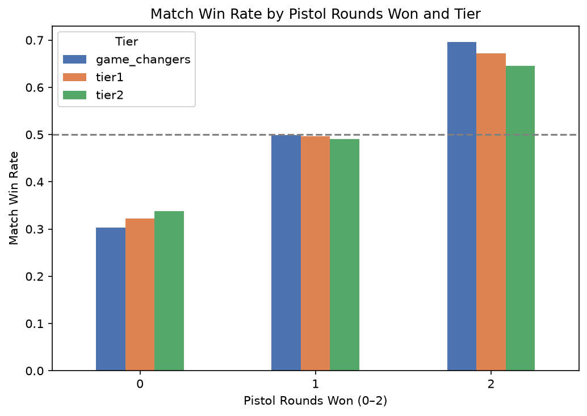
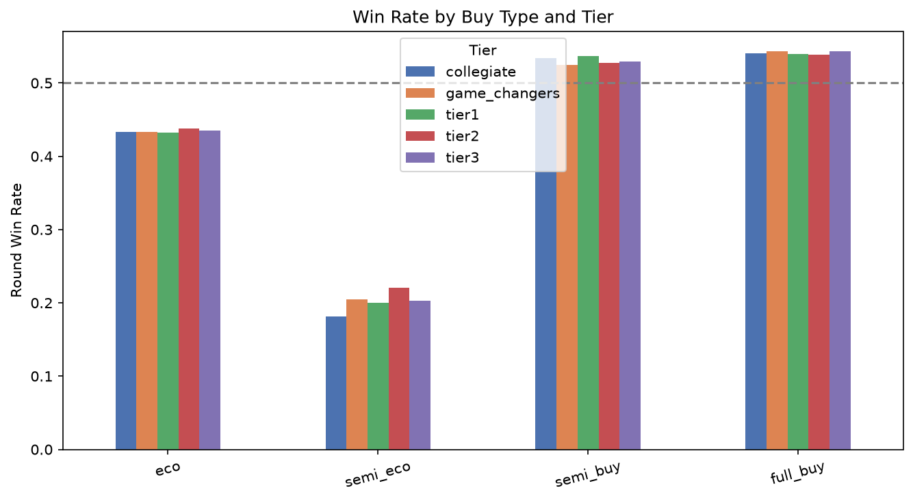
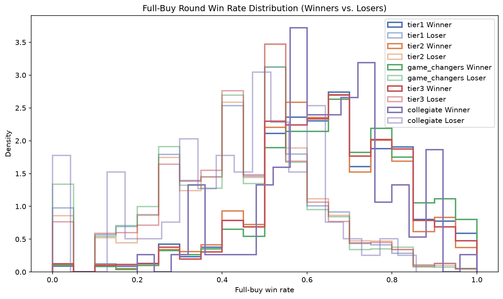
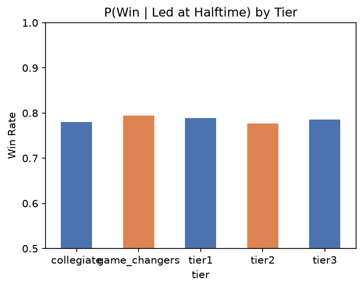
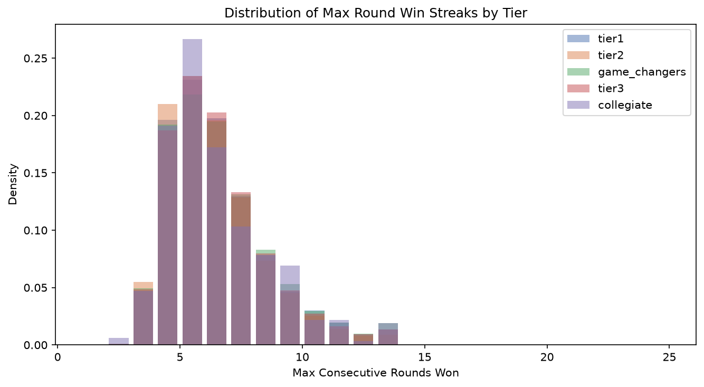
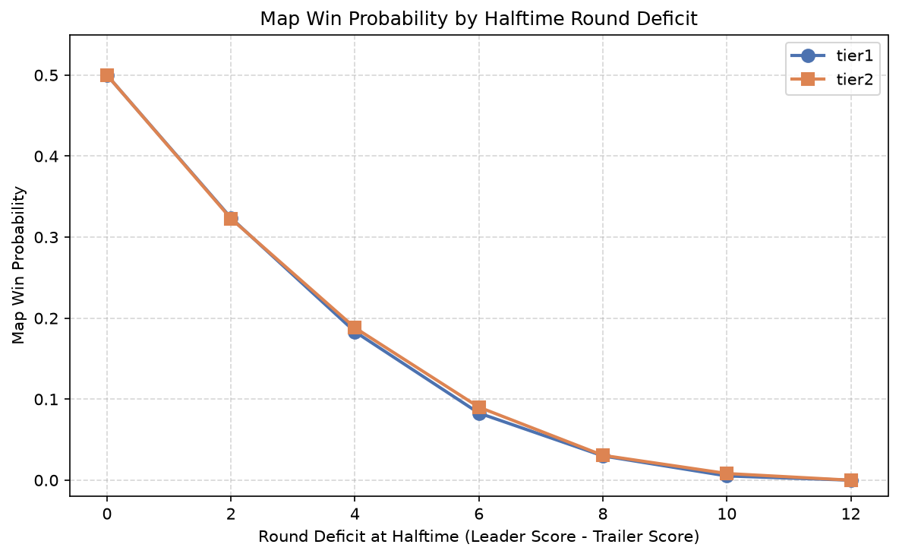

---

## 5. Team Tier Trajectory (T2 → T1 Win Rate Transfer)

For the **56 teams** that played at least 20 maps in both Tier 1 and Tier 2 (strictly requiring at least 3 players in common between the Tier 2 roster and the Tier 1 maps):
* **Linear OLS Fit**: $y = 0.07x + 0.45$
* **$R^2$**: $0.0082$

> [!CAUTION]
> A team's Tier 2 map win rate has almost zero correlation ($R^2 pprox 0.82\%$) with their subsequent win rate in Tier 1. The slope is extremely flat ($0.07$). This indicates a severe step-up in competition; even when maintaining roster continuity (at least 3 players), historical dominance in Tier 2 fails to predict success in the Tier 1 arena.

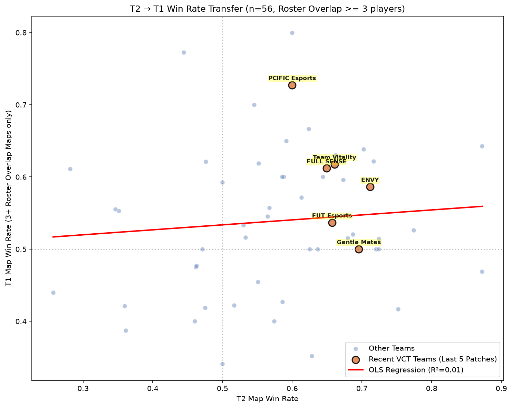

---

For the **180 teams** that played at least 1 map in both Tier 1 and Tier 2 (unfiltered by map volume, requiring at least 3 players in common):
* **Linear OLS Fit**: $y = 0.33x + 0.33$
* **$R^2$**: $0.0985$

> [!NOTE]
> Lowering the map volume filter to 1 map introduces more variance but captures **180 teams** (including **8 recent VCT teams** like Xi Lai Gaming and Team Heretics). 
> The OLS fit shows a higher $R^2 pprox 9.85\%$ and slope of $0.33$, but this is heavily influenced by high-variance teams with very small map samples (e.g. 1-2 maps) achieving win rates of 1.0 or 0.0.

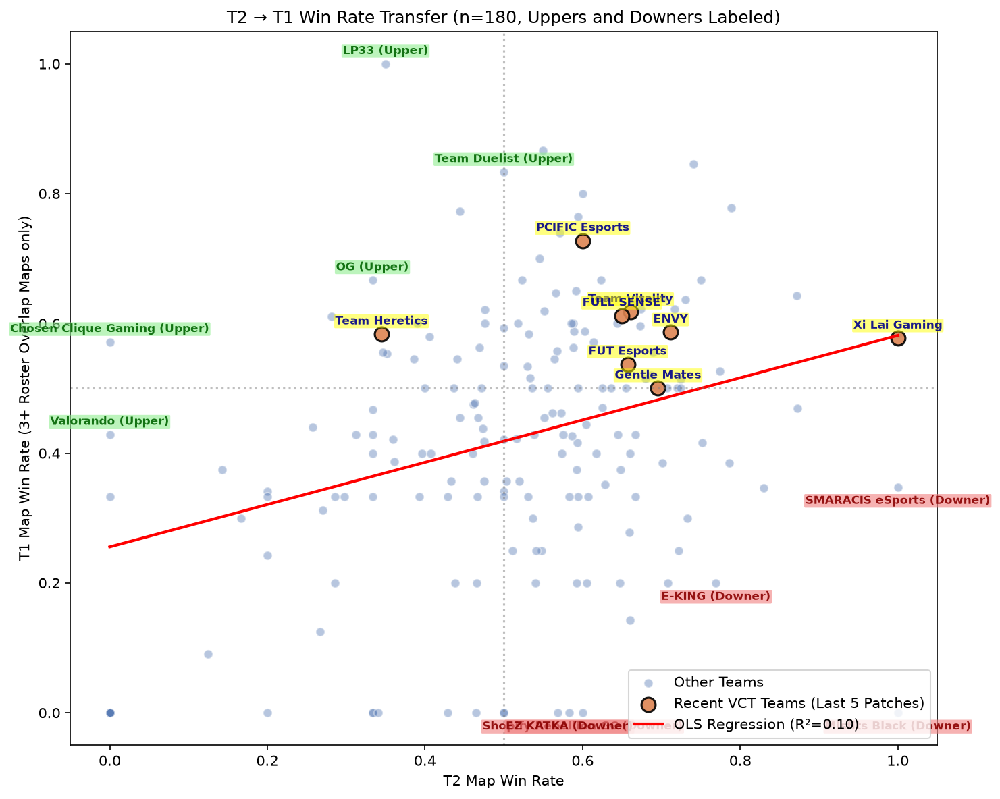

## Completed Notebooks
All analysis runs are preserved and fully executed in the respective notebooks:
1. [00_validate_labels.ipynb](00_validate_labels.ipynb)
2. [01_overview.ipynb](01_overview.ipynb)
3. [02_map_analysis.ipynb](02_map_analysis.ipynb)
4. [03_player_performance.ipynb](03_player_performance.ipynb)
5. [04_economy.ipynb](04_economy.ipynb)
6. [05_round_level.ipynb](05_round_level.ipynb)
7. [06_team_trajectory.ipynb](06_team_trajectory.ipynb)
8. [07_offseason_analysis.ipynb](07_offseason_analysis.ipynb)
