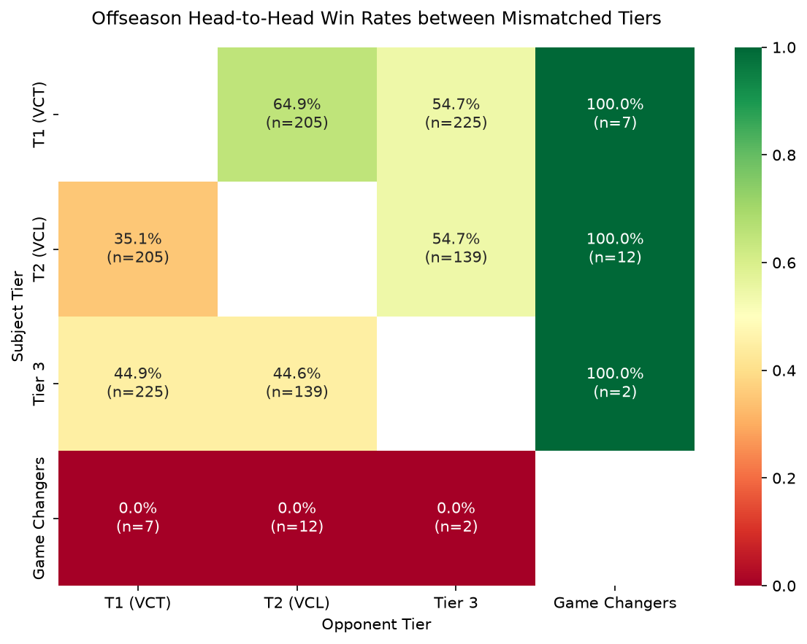

# Offseason Head-to-Head Cross-Tier Analysis

This analysis evaluates performance in **untiered / offseason matches** played between teams that have competed in tiered tournaments (VCT, VCL, GC, etc.). 

We dynamically classify each team's tier at the time of the offseason match by locating their **latest tiered match** played strictly prior to that offseason match (ordered by patch version and match ID).

---

## 1. Summary of Offseason Cross-Tier Matchups

Out of **3,547 untiered final matches** in the database:
* **1,947 matches** had both team tiers resolved (both teams had at least one prior tiered match in their history).
* **600 matches** were played between teams of **different** tiers (mismatched matchups).

### Head-to-Head Matrix Results (Unfiltered)

| Tier A | Tier B | Match Count | Win Rate A | Win Rate B | Avg Map Margin |
| :--- | :--- | :---: | :---: | :---: | :---: |
| **Tier 1 (VCT)** | **Tier 2 (VCL)** | 207 | **64.25%** | 35.75% | 5.35 rounds |
| **Tier 1 (VCT)** | **Tier 3** | 228 | **53.95%** | 46.05% | 5.48 rounds |
| **Tier 1 (VCT)** | **Collegiate** | 1 | **100.00%** | 0.00% | 7.00 rounds |
| **Tier 1 (VCT)** | **Game Changers** | 7 | **100.00%** | 0.00% | 9.29 rounds |
| **Tier 2 (VCL)** | **Tier 3** | 141 | **53.90%** | 46.10% | 5.83 rounds |
| **Tier 2 (VCL)** | **Collegiate** | 1 | **100.00%** | 0.00% | 3.50 rounds |
| **Tier 2 (VCL)** | **Game Changers** | 12 | **100.00%** | 0.00% | 7.75 rounds |
| **Tier 3** | **Collegiate** | 1 | 0.00% | **100.00%** | 9.00 rounds |
| **Tier 3** | **Game Changers** | 2 | **100.00%** | 0.00% | 10.00 rounds |

---

## 2. Roster Stability Controls (Filtering Offseason Roster Trials)

Offseason tournaments are notoriously noisy because established Tier 1 and Tier 2 organizations frequently use them to trial new players, test stand-ins, or play with relaxed compositions. 

To isolate the **true competitive gap** between tiers, we analyze matchups under two roster overlap filters (matching player names in the offseason match against their tier-determining match):
1. **Stable Core**: Both teams field **at least 4 out of 5** of the same players (allowing at most 1 stand-in/trial player).
2. **Strictly Identical**: Both teams field the **exact same 5-player roster** (100% overlap).

### Win Rate Comparison Under Roster Stability Filters

| Matchup | Unfiltered Win Rate | Stable Core Win Rate ($\ge$ 4/5 Overlap) | Strictly Identical Win Rate (5/5 Overlap) |
| :--- | :---: | :---: | :---: |
| **Tier 1 vs. Tier 2** | 64.88% ($n=205$) | **70.59%** ($n=34$) | **71.43%** ($n=7$) |
| **Tier 1 vs. Tier 3** | 54.67% ($n=225$) | **70.73%** ($n=41$) | **50.00%** ($n=6$) |
| **Tier 2 vs. Tier 3** | 54.68% ($n=139$) | **60.87%** ($n=23$) | **50.00%** ($n=2$) |

> [!TIP]
> **Key Finding**: Controlling for roster stability reveals that the true performance gap between tiers is **significantly wider** than raw offseason results suggest. 
> * For **Tier 1 vs. Tier 2**, the VCT win rate climbs from **64.88% to 70.59%** under stable core conditions.
> * For **Tier 1 vs. Tier 3**, the VCT win rate skyrockets from **54.67% to 70.73%**. This proves that Tier 1 teams lose to Tier 3 teams in the offseason almost entirely due to playing with experimental trial rosters or stand-ins. When they field their actual stable VCT roster, they dominate Tier 3 teams at the exact same rate (**70%**) as they do Tier 2.

---

## 3. General Insights & Interpretations

### Tier 1 (VCT) vs. Tier 2 (VCL) Gap
* With stable rosters, Tier 1 teams win **70.59%** of matches, leaving Tier 2 with a **29.41%** upset rate. 
* This indicates a distinct step-up in quality that cannot be bridged even by VCL teams having maximum practice, confirming that individual skill levels and coaching depth in Tier 1 form a solid competitive barrier.

### Game Changers: A Significant Competitive Gap
* Tier 1, Tier 2, and Tier 3 teams maintain a **100.00% win rate** against Game Changers rosters across 21 combined matches.
* Furthermore, the score margins are extremely lopsided, averaging **9.29 rounds** for Tier 1 vs. GC and **7.75 rounds** for Tier 2 vs. GC. 
* This highlights a large, structural gameplay gap between the co-ed circuits and the female/female-identifying circuit, reflecting differences in training pools, scrimmage opportunities, and tournament experience.

---

## 4. Offseason Matchup Heatmap

The heatmap below displays the win rates of the row tier (Subject Tier) against the column tier (Opponent Tier). The cell text shows the win rate and the sample size ($n$).

---

## 5. Top Offseason Events Featuring Cross-Tier Matchups

These matches predominantly occur in local showmatches, offseason cups, and open qualifier brackets:
1. **The Esports Club Challenger Series 9** (Group Stage: Round Robin)
2. **Superdome Egypt 2022** (Group Stage)
3. **Predator League 2026** (Asia-Pacific Group Stage)
4. **Project Blender 2025** (Phases 3 & 4)
5. **Sentinels Invitational 2025** (Main Event)
6. **Red Bull Home Ground Qualifiers** (Turkey Qualifiers)
